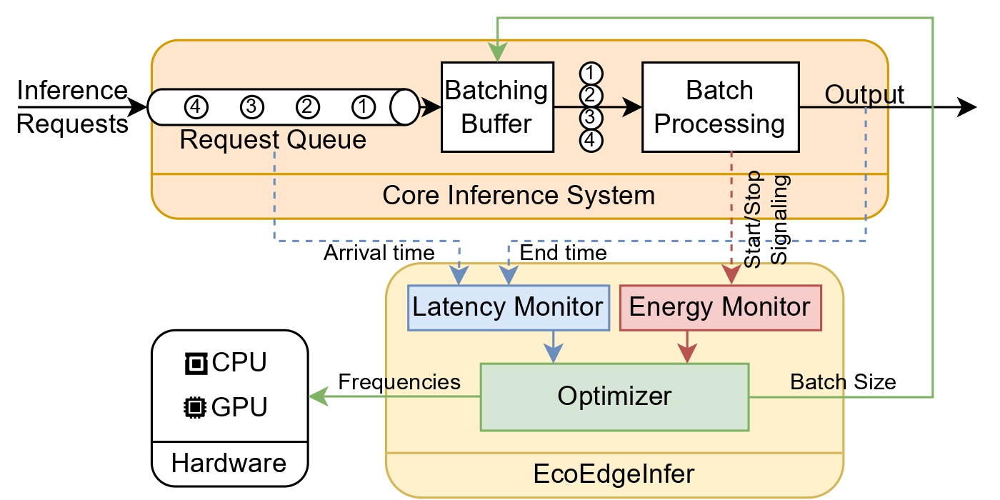

# EcoEdgeInfer

This repository contains the implementation code for our paper - [EcoEdgeInfer](https://pramodh.rachuri.dev/files/pramodh_EcoEdgeInfer_sec24.pdf).

## Quick Start

To see the EcoEdgeInfer framework and the **EcoGD optimizer** in action, simply run the `example_EcoGD.py` file:  
```bash
python3 example_EcoGD.py
```

> **Note:** The code is currently being cleaned and better documented for enhanced readability. However, it should function as expected. If you encounter any issues, feel free to raise an issue in this repository.

## Table of Contents
1. [EcoEdgeInfer Framework](#1-ecoedgeinfer-framework)  
   - [Overview](#overview)  
   - [Optimizers](#optimizers)  
   - [Extensibility](#extensibility)  
2. [nvpmplus Library](#2-nvpmplus-library)  
   - [Features](#features)  
   - [Usage](#usage)  
3. [power_profile Library](#3-power_profile-library)  
   - [Features](#features-1)  
   - [Usage](#usage-1)  
4. [Miscellaneous](#4-miscellaneous)  
5. [Citation](#5-citation)

---

## Repository Overview

### 1. `EcoEdgeInfer.py`
This file contains the implementation of the **EcoEdgeInfer** framework. Import this module to integrate the framework into your own projects. Below is a high-level overview of the framework:

<p align="center">
    
</p>

#### Optimizers
The following optimizers are included in the framework:  
- Grid Search  
- Linear Search  
- DVFS  
- Multi-Armed Bandit (Independent Dimensions)  
- **EcoGD**  
- Bayesian Optimization  
- Multi-Armed Bandit (Joint Search Space)  
- Random Choice  
- Fixed Choice  

Details and comparisons for a subset of these optimizers are available in the paper.  

#### Extensibility
To add a custom optimizer:  
1. Extend the `EnergyOptimizer_skeleton` class.  
2. Implement the `run_optimizer` method.  

For reference, you can review the implementation of `EnergyOptimizer_linearsweeps` (a simple optimizer).  
Additionally, method overriding can be used to adjust behavior. For example, the `EnergyOptimizer_MAB_multiDim` class overrides the `update_history` method to modify how history is updated for the MAB optimizer.  

Detailed method and class descriptions are available as **docstrings** within the code.

---

### 2. `nvpmplus.py`
The **nvpmplus** library offers fine-grained control over power modes on Jetson devices (e.g., Nano, Xavier NX). While `nvpmodel` provides limited preset modes, `nvpmplus` allows setting custom CPU and GPU frequencies as well as changing governors.  

#### Features:
- Adjust CPU and GPU frequencies to any value within the device’s range.  
- Change the governor of the CPU and GPU.  
- Tested on Jetson Nano and Xavier NX.  

**Usage**  
It can used within Python scripts or as a standalone script. For running within a script, import the library and use the `set_state` or `set_gov` method. Example:  `nvpmplus.set_state(nvpmplus.cpu_lim, cpu, gpu)`
For standalone usage, run the script with the desired arguments. More details are available in the help section.

```
> python3 nvpmplus.py --help

running on Jetson Xavier
usage: nvpmplus.py [-h] [--cpus CPUS] [--cpu_max_fq CPU_MAX_FQ] [--gpu_max_fq GPU_MAX_FQ]
                   [--cpu_gov CPU_GOV] [--gpu_gov GPU_GOV] [--ONLY_GOV ONLY_GOV] [--ONLY_FREQ ONLY_FREQ]

nvpmodel plus

options:
  -h, --help            show this help message and exit
  --cpus CPUS           Input can be 1 to 6
  --cpu_max_fq CPU_MAX_FQ
                        Input can be 0 to 24
  --gpu_max_fq GPU_MAX_FQ
                        Input can be 0 to 14
  --cpu_gov CPU_GOV     Input a CPU governor: interactive, conservative, ondemand,
                        userspace, powersave, performance, schedutil
  --gpu_gov GPU_GOV     Input a GPU governor: wmark_simple, nvhost_podgov,
                        userspace, performance, simple_ondemand
  --ONLY_GOV ONLY_GOV   Set only the governor
  --ONLY_FREQ ONLY_FREQ
                        Set only the frequency
```

---

### 3. `power_profile.py`
The **power_profile** library measures power consumption of specific functions with high precision. Unlike `tegrastats` (which samples every second), `power_profile` offers higher sampling rates, making it easier to measure energy consumption for individual functions.

#### Features:
- Measure energy consumption in Joules.  
- High sampling rate for precise profiling.  
- Tested on Jetson Nano and Xavier NX.

**Usage**  
Use the `energy_calculator` method to measure energy consumption:  
```python
power_profile.energy_calculator(user_function, batch_input)
```
- **`user_function`**: The function to be profiled.  
- **`batch_input`**: The input to the function.  

The method returns the energy consumed in Joules.

---

## Miscellaneous

Due to size constraints, trace logs and processed data are not included in this repository. If you need access, please contact me via [pramodh.rachuri.dev](https://pramodh.rachuri.dev/), and I’ll be happy to provide the data.

---

## Citation

If you use this code or find the **EcoEdgeInfer** framework helpful in your research, please cite our paper:  
```bibtex
@inproceedings{rachuri2024ecoedgeinfer,
  title={EcoEdgeInfer: Dynamically Optimizing Latency and Sustainability for Inference on Edge Devices},
  author={Sri Pramodh Rachuri and Nazeer Shaik and Mehul Choksi and Anshul Gandhi},
  booktitle = {Proceedings of the Ninth ACM/IEEE Symposium on Edge Computing},
  series = {SEC '24}
}
```

> **Note:** The official citation will be updated once the paper is published.

---

This version improves readability, organization, and flow while retaining all the details you provided. Let me know if you want further adjustments!